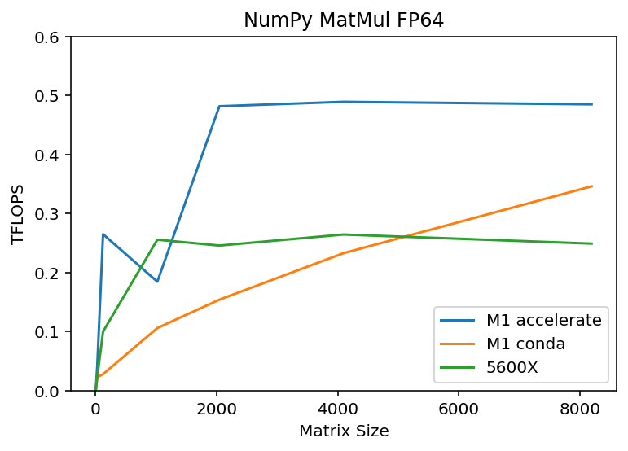
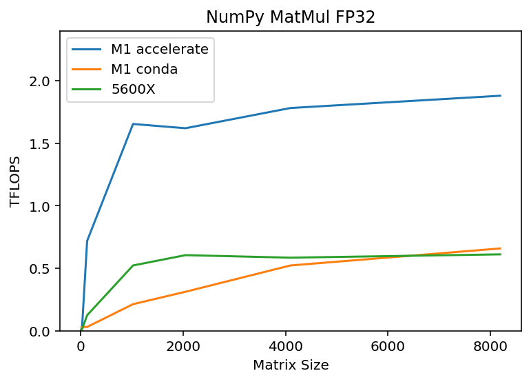
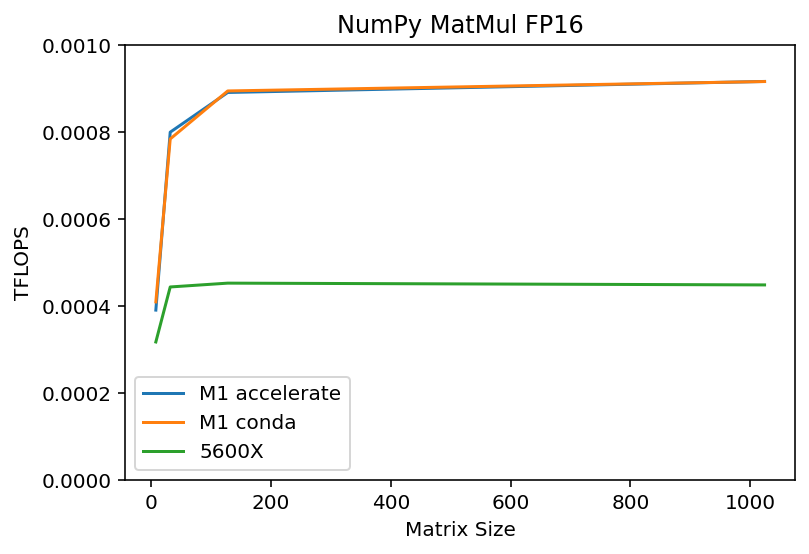

# M1 CPU Benchmarks

To test CPU-based performance on M1 on various compute tasks.

## Benchmarks

Preface: benchmarking is hard, there are many possible configs/compile options etc for things like NumPy, as well as many different tasks. Constructive feedback is wellcome! 

All benchmark here is performed with M1 Max (10 core) on 16-inch MBP 2021 with charger plugged in and High Power mode enabled.

### Numpy

Benchmark a variety of different functions in NumPy.

[Accelerate](https://developer.apple.com/documentation/accelerate) is Apple's high-performance computation library. NumPy can be compiled with support for Accelerate. M1 is almost 2x faster in MatMul, almost certainly because the Accelerate library is dispatching the MatMul to the "secret" AMX coprocessor.

Comparison between NumPy (with Accelerate) vs NumPy (from conda) vs 5600X. Numpy reported configs for each can be found in the [Setup & Configs](https://github.com/tlkh/m1-cpu-benchmarks#setup--configs) section below.

Timings for task reported, lower is better.

| Task       | M1+Accelerate | Conda | 5600X | 5600X+MKL |
| ---------- | ---------- | ----- | ----- | -- |
| datagen    | 0.348 | 0.385 | 0.472 | 0.462 |
| special    | 0.447 | 0.459 | 0.599 | 1.149 |
| stats      | 1.017 | 1.253 | 0.961 | 1.018 |
| matmul     | 0.301 | 0.602 | 0.509 | 0.616 |
| vecmul     | 0.011 | 0.015 | 0.009 | 0.007 |
| svd        | 0.469 | 1.591 | 0.372 | 0.287 |
| cholesky   | 0.069 | 0.097 | 0.111 | 0.111 |
| eigendecomp| 4.911 | 7.635 | 3.214 | 2.749 |

Benchmark script: `numpy_benchmarks.py`.

Using a MatMul as a proxy to measure the CPU's TFLOPS:

| FP64 | FP32 | FP16 | 
| ---- | ---- | ---- |
|  |  | 

For NumPy, you definitely want to be using Accelerate!

Benchmark script: `numpy_tflops.py`.

### SpaCy

Overall, the M1 is faster than the desktop 5600X! On M1, Accelerate (via NumPy) doesn't seem to affect anything. PyTorch seems to be affected by NumPy performance. Installing SpaCy's AppleOps which allows SpaCy to directly call Accelerate provides a dramatic performance improvement.

Tokens/second reported, higher is better.

| config | en_core_web_sm | en_core_web_md | en_core_web_lg | en_core_web_trf |
| ------ | -------------- | -------------- | -------------- | --------------- |
| M1 (conda: [env 1](#env-1-generic))       | 3143 | 2899 | 2853 |  309 |
| M1 (accelerate: [env 2](#env-2-accelerate))    | 3191 | 2899 | 2900 | 1064 |
| M1 (appleops: [env 3](#env-3-spacyappleops))| 17295 | 16772 | 16670 | 1121 |
| M1 (env 2+AppleOps)                | 17966 | 16796 | 16946 | 1193 |
| 5600X                 | 9580 | 8748 | 8773 |  487 |
| 5600X + MKL           | 13895 | 12843 | 12916 | 1107 |

For SpaCy, you want to be using SpaCy+AppleOps, the rest doesn't really matter.

Note: for the SpaCy benchmarks, run-to-run variances can be fairly big (due to CPU clocking or background OS tasks, I am not sure), so +/- less than 10% can be considered to be roughly the same performance.

Benchmark script: `spacy_benchmarks.py`.

### Jax

Simple benchmark, set up to be similar to the NumPy one to measure TFLOPS. Performs similar to conda install of NumPy, hence probably is not aware of the AMX. Functionally, things like JIT, VMAP work, but in our simple test don't give any performance gains. For refence, M1 can score almost 1.9 TFLOPS using the Accelerate library via NumPy, and should be able to exceed 2 TFLOPS if calling Accelerate directly without any Python overhead. Hence, for any MatMul-heavy work, Jax is likely going to be slower than NumPy.

TFLOPS reported, higher is better.

| Task           | M1    | 5600X |
| -------------- | ----- | ----- |
| MatMul         | 0.559 | 0.594 |
| JIT MatMul     | 0.558 | 0.593 |
| JIT+VMAP MatMul| 0.546 | 0.419 |

Benchmark script: `jax_benchmarks.py`.

### Pandas

Timings reported in seconds, lower is better.

| Task | M1 | 5600X |
| ---- | -- | ----- |
| datagen | 3.2 | 3.4 |
| inner_merge | 17.6 | 27.4 |
| outer_merge | 27.6 | 41.9 |

outer_merge is single core-only, the rest were run with the optimal number of cores tested:

* 5600X: 2 cores was the fastest (tested 1, 2, 4, 6, 12)
* M1: 10 cores was the fasted (tested 1, 2, 8, 10)

Performance mostly agrees with peak bandwidth measured by STREAM benchmark! I wanted to test something that a little more memory intensive to test out the M1's memory bandwidth from the CPU. Looks like this would be it.

* Peak bandwidth from a M1 P-core is about 97GB/s (avg over 1s is about 79 GB/s)
* Peak bandwidth from a 5600X core is about 42GB/s.
* Thus outer_merge is about 50% faster on M1, which has about 2x the memory bandwidth.
* With overall higher memory bandwidth and being able to leverage more cores, inner_merge is much faster as well.

## Setup & Configs

### Env 1: Generic

The goal is to test an out-of-the-box conda install.

1. `conda install numpy spacy`
2. Were you expecting more?

NumPy config:

```
blas_info:
    libraries = ['cblas', 'blas', 'cblas', 'blas']
    library_dirs = ['/Users/tlkh/miniforge3/envs/py-vanilla/lib']
    include_dirs = ['/Users/tlkh/miniforge3/envs/py-vanilla/include']
    language = c
    define_macros = [('HAVE_CBLAS', None)]
blas_opt_info:
    define_macros = [('NO_ATLAS_INFO', 1), ('HAVE_CBLAS', None)]
    libraries = ['cblas', 'blas', 'cblas', 'blas']
    library_dirs = ['/Users/tlkh/miniforge3/envs/py-vanilla/lib']
    include_dirs = ['/Users/tlkh/miniforge3/envs/py-vanilla/include']
    language = c
lapack_info:
    libraries = ['lapack', 'blas', 'lapack', 'blas']
    library_dirs = ['/Users/tlkh/miniforge3/envs/py-vanilla/lib']
    language = f77
lapack_opt_info:
    libraries = ['lapack', 'blas', 'lapack', 'blas', 'cblas', 'blas', 'cblas', 'blas']
    library_dirs = ['/Users/tlkh/miniforge3/envs/py-vanilla/lib']
    language = c
    define_macros = [('NO_ATLAS_INFO', 1), ('HAVE_CBLAS', None)]
    include_dirs = ['/Users/tlkh/miniforge3/envs/py-vanilla/include']
Supported SIMD extensions in this NumPy install:
    baseline = NEON,NEON_FP16,NEON_VFPV4,ASIMD
    found = 
    not found = ASIMDHP,ASIMDDP
```

### Env 2: Accelerate 

1. `conda install pip`
2. Install all relevant packages and dependencies for building NumPy and SpaCy: `pip install pytest hypothesis cython`. We're going to build NumPy and SpaCy from source. 
3. `git clone https://github.com/numpy/numpy`
4. `git checkout maintenance/1.21.x`
5. `python setup.py build_ext --inplace -j 10` With 10 threads for compile (feel free to adjust this), my M1 Max finishes in less than 30 seconds. 
6. Run tests: `python runtests.py -v -m full`, and you should get an output similar to `15457 passed, 213 skipped, 23 xfailed in 170.07s` aka the test suite passes.
7. `pip install .`

Now we can check the NumPy config available to us. For mine, it looks like this (relevant section shown):

```
accelerate_info:
    extra_compile_args = ['-I/System/Library/Frameworks/vecLib.framework/Headers']
    extra_link_args = ['-Wl,-framework', '-Wl,Accelerate']
    define_macros = [('NO_ATLAS_INFO', 3), ('HAVE_CBLAS', None)]
blas_opt_info:
    extra_compile_args = ['-I/System/Library/Frameworks/vecLib.framework/Headers']
    extra_link_args = ['-Wl,-framework', '-Wl,Accelerate']
    define_macros = [('NO_ATLAS_INFO', 3), ('HAVE_CBLAS', None)]
lapack_opt_info:
    extra_compile_args = ['-I/System/Library/Frameworks/vecLib.framework/Headers']
    extra_link_args = ['-Wl,-framework', '-Wl,Accelerate']
    define_macros = [('NO_ATLAS_INFO', 3), ('HAVE_CBLAS', None)]
Supported SIMD extensions in this NumPy install:
    baseline = NEON,NEON_FP16,NEON_VFPV4,ASIMD
    found = ASIMDHP,ASIMDDP
    not found = 
```

From here, we can run our NumPy and SpaCy benchmarks that leverage NumPy.

### Env 3: SpaCy+AppleOps

Note that as of 3.1.4, SpaCy can optionally leverage Accelerate directly! To use it, you need to start from a fresh environment, there seem to be other factors that affect the performance, **you need to start clean otherwise you only get about half the performance boost for some reason**.

```
rm -rf /Users/$USER/Library/Caches/pip
pip install --no-cache-dir 'spacy[apple]'
```

### Jax

1. `conda install pip numpy scipy`
2. `pip install -U https://storage.googleapis.com/jax-releases/mac/jaxlib-0.1.74-cp39-none-macosx_11_0_arm64.whl`
3. `pip install jax`

Still very early days for Jax on ARM/M1, issue being tracked [here](https://github.com/google/jax/issues/5501).

### Reference 5600X

Base config: NumPy from NGC PyTorch container, which should be reasonably optimized.

NumPy config:

```
blas_info:
    libraries = ['cblas', 'blas', 'cblas', 'blas']
    library_dirs = ['/opt/conda/lib']
    include_dirs = ['/opt/conda/include']
    language = c
    define_macros = [('HAVE_CBLAS', None)]
blas_opt_info:
    define_macros = [('NO_ATLAS_INFO', 1), ('HAVE_CBLAS', None)]
    libraries = ['cblas', 'blas', 'cblas', 'blas']
    library_dirs = ['/opt/conda/lib']
    include_dirs = ['/opt/conda/include']
    language = c
lapack_info:
    libraries = ['lapack', 'blas', 'lapack', 'blas']
    library_dirs = ['/opt/conda/lib']
    language = f77
lapack_opt_info:
    libraries = ['lapack', 'blas', 'lapack', 'blas', 'cblas', 'blas', 'cblas', 'blas']
    library_dirs = ['/opt/conda/lib']
    language = c
    define_macros = [('NO_ATLAS_INFO', 1), ('HAVE_CBLAS', None)]
    include_dirs = ['/opt/conda/include']
Supported SIMD extensions in this NumPy install:
    baseline = SSE,SSE2,SSE3
    found = SSSE3,SSE41,POPCNT,SSE42,AVX,F16C,FMA3,AVX2
    not found = AVX512F,AVX512CD,AVX512_KNL,AVX512_KNM,AVX512_SKX,AVX512_CLX,AVX512_CNL,AVX512_ICL
```

For the above NumPy, no diff observed with `MKL_DEBUG_CPU_TYPE=5` flag.

MKL config: Install NumPy + MKL from Conda in a clean conda env.

```
blas_mkl_info:
    libraries = ['mkl_rt', 'pthread']
    library_dirs = ['/opt/conda/lib']
    define_macros = [('SCIPY_MKL_H', None), ('HAVE_CBLAS', None)]
    include_dirs = ['/opt/conda/include']
blas_opt_info:
    libraries = ['mkl_rt', 'pthread']
    library_dirs = ['/opt/conda/lib']
    define_macros = [('SCIPY_MKL_H', None), ('HAVE_CBLAS', None)]
    include_dirs = ['/opt/conda/include']
lapack_mkl_info:
    libraries = ['mkl_rt', 'pthread']
    library_dirs = ['/opt/conda/lib']
    define_macros = [('SCIPY_MKL_H', None), ('HAVE_CBLAS', None)]
    include_dirs = ['/opt/conda/include']
lapack_opt_info:
    libraries = ['mkl_rt', 'pthread']
    library_dirs = ['/opt/conda/lib']
    define_macros = [('SCIPY_MKL_H', None), ('HAVE_CBLAS', None)]
    include_dirs = ['/opt/conda/include']
Supported SIMD extensions in this NumPy install:
    baseline = SSE,SSE2,SSE3
    found = SSSE3,SSE41,POPCNT,SSE42,AVX,F16C,FMA3,AVX2
    not found = AVX512F,AVX512CD,AVX512_KNL,AVX512_KNM,AVX512_SKX,AVX512_CNL
```

For the NumPy+MKL config, no diff observed with `MKL_DEBUG_CPU_TYPE=5` flag either, for PyTorch and NumPy perf.

Torch config:

```
>>> import torch
>>> torch.backends.mkldnn.is_available()
True
>>> torch.backends.mkl.is_available()
True
```
